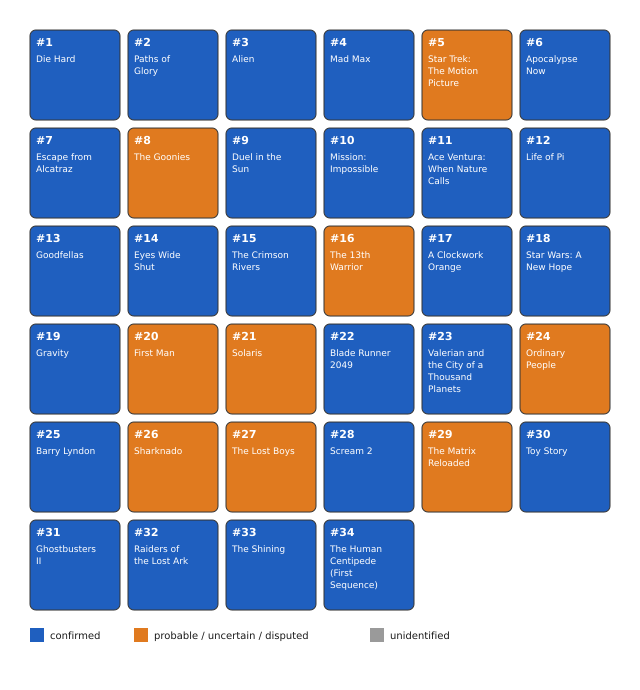

# Bitcoin Movie Enigma (100,000 sats, [OPEN])

"klems" published this puzzle across Nostr, X, and Instagram in January 2024: 34
numbered panels, each a still from a different movie, that together encode a
24-word BIP39 seed phrase for a wallet funded with 100,000 sats. The rules, still
published on the author's own site, describe a two-step transform: turn each of the
34 movie titles into an English BIP39 word, then drop 10 "intruder" words using
information found on each film's IMDb page, leaving the real 24-word seed in panel
order. The derivation is fully understood and bounded once the inputs are known.
All 34 films are now identified with confidence. What is missing is the two-step
transform itself: 2 titles still have no literal BIP39 word as a substring of the
title (Sharknado, Raiders of the Lost Ark; a third, Barry Lyndon, is explained by
the leading intruder hypothesis instead), and the IMDb field that splits the 24
keepers from the 10 intruders is not yet settled -- the leading candidate (shares a
director or lead actor with another panel here) was found 2026-08-19 but is itself
in question after a panel re-identification the same day (see "What is understood"
below).

## At a glance

| | |
|---|---|
| Author | klems, [Nostr npub10q5dpm5p05a0g3vtgcl76wv0pc4t820f5fj8qmpfaa4umv6404xqvwzvp0](https://njump.me/npub10q5dpm5p05a0g3vtgcl76wv0pc4t820f5fj8qmpfaa4umv6404xqvwzvp0) |
| Published | 2024-01-03, Nostr, X and Instagram ([rules](https://bitcoinmovieenigma.com/rules)) |
| Prize | 100,000 sats (about $63 at BTC = $63,000, 2026-08-16) |
| Chain | bitcoin |
| Escrow | `bc1q94ecsn0qk8lap2gefrycnms3ruepy889z969a6` ([explorer](https://mempool.space/address/bc1q94ecsn0qk8lap2gefrycnms3ruepy889z969a6)) |
| Last on-chain check | 2026-08-19: funded and unspent (100,000 sats) |
| Status | OPEN |
| Puzzle type | bip39-seed, text-cipher, word-selection |
| Target format | BIP39 24 words (English), most likely BIP84 `m/84'/0'/0'/0/i` (script type `v0_p2wpkh`), no passphrase stated |
| Certified oracle | yes: `tools/oracle.py --selftest` (certified against the public BIP39/BIP84 test vectors) |
| What remains | real words for 2 gap panels (Sharknado, Raiders of the Lost Ark); panel 11 corrected 2026-08-19 to Ace Ventura: When Nature Calls (evidentiary tension noted, not fully resolved); panel 8 briefly corrected to Shutter Island then reverted to The Goonies per user instruction, with Shutter Island kept as a live probability; a local brute-force run 2026-08-20 checked 205,263,936 candidates (every word-cross under H1 exactly as stated, plus every single-panel swap of H1's own membership) against the live escrow, all 0 matches |
| Series | none |

## The puzzle as published

The rules page, still live at [bitcoinmovieenigma.com/rules](https://bitcoinmovieenigma.com/rules),
states the mechanism directly:

> "Guess all the 34 movie titles, from the provided movie frames."

> "Transform 'somehow' each movie title into an English BIP-0039 seed word."

> "The seedphrase you have is 34 words long, but we should have a 24 words
> seedphrase instead. Some movies should not be in the sequence, and should be
> considered intruders, but which ones? You will need additional informations
> about each movie to detect those intruders 'somehow'. Every information you need
> can be found on IMBD, on each movie's page."

> "Once you got rid of the intruders, you can restore the Bitcoin wallet using the
> 24 words passphrase with any compatible software."

The 34 panels were posted one per day (by their displayed date, 2024-01-03 through
2024-02-05) on the author's Nostr account and cross-posted to X and Instagram,
later mirrored to a dedicated site because, in the author's own words on the site's
about page, "some platforms compressed the movie frames poorly." Each panel is a
still from a different film; I do not reproduce them here, since they are
third-party film frames and the site hosting them is still live (see
[clues/author-posts.md](clues/author-posts.md) for direct links and further
quotes). A separate "alternative release" republishes the same 34 stills as a
single combined image; I confirmed byte for byte that all 34 match the individual
panels exactly, so it carries no extra information.

The escrow's wallet page names the address directly and lists the author's own
funding entry, "100000 | 4/08/2022," in a donation ledger, which matches the
escrow's on-chain funding date and resolves what would otherwise look like an
unexplained 21-month gap between funding and the January 2024 launch: the wallet
was pre-funded as a donation well before the puzzle was announced.

## What is understood

### Mechanism

Each of the 34 panels is one movie still, in a fixed panel order. Identifying the
34 titles and transforming each into an English BIP39 word gives a 34-word
sequence. Ten of those 34 words are "intruders" to be identified and dropped using
information on each film's IMDb page, leaving the real 24-word mnemonic in panel
order. The escrow's script type, `v0_p2wpkh`, points to BIP84 as the most likely
derivation, though the author never states the path directly, so the oracle also
checks BIP49, BIP44, and 3 raw derivation paths some simple wallets use.

### Derivation and oracle

```
python3 tools/oracle.py --selftest
python3 tools/oracle.py "w1 w2 ... w24"
```

The oracle validates a 24-word candidate as a BIP39 mnemonic, derives every
plausible address (BIP84, BIP49 and BIP44 across 5 accounts and 10 indices each,
both external and internal/change chains, plus 3 raw paths -- widened 2026-08-24
from the original 2 accounts x 3 indices, external chain only, after an extended
negative result across every other tested hypothesis made the narrower path
coverage itself worth ruling out), and compares each to the escrow address.
`MATCH <address> via <path>` on a hit, `NO MATCH` otherwise. To check which 10 of
34 known words to drop, generate the 24-word reductions yourself and pipe them
through `--stdin`; the puzzle's own arithmetic bounds this to C(34,10) =
131,128,140 raw combinations, cut by the BIP39 checksum (1 in 256) to about
512,000 candidates. Only the checksum-valid fraction pays the full address-derivation
cost, so overall throughput on a full sweep is close to (not 14x worse than) the
narrower version -- roughly 1.5x slower single-threaded (~7,900/s vs ~12,000/s on
a realistic mixed sample), since checksum-invalid candidates (the vast majority)
are rejected before any address is derived either way. That bound only applies
once all 34 words and their order are known, which is not yet the case here.

### Certified against

No solved sibling exists for this puzzle, so `tools/oracle.py --selftest` certifies
the derivation path against the public BIP39/BIP84 test vectors: the 12-word
mnemonic "abandon" repeated 11 times plus "about" derives address
`bc1qcr8te4kr609gcawutmrza0j4xv80jy8z306fyu`, and the 24-word mnemonic "abandon"
repeated 23 times plus "art" is confirmed to be checksum-valid and to derive a
non-empty address; a 1-word-off variant is correctly rejected by the checksum.
Reproduced 2026-08-16.

### Established facts

1. The escrow is funded and unspent as of 2026-08-16 (checked via
   [mempool.space](https://mempool.space)); the single funding transaction
   confirmed 2022-04-08 at block 730990.
2. The escrow's own wallet page names the address and lists the author's funding
   entry with the same date, resolving the apparent gap between funding and launch.
3. Both published image sets (individual panels and the "alternative release") are
   byte-for-byte identical, 34 of 34, confirmed by MD5.
4. All 34 films are identified, though 2 panels carry open evidentiary tension:
   panel 34 (The Human Centipede (First Sequence), 2009) is settled with
   independent sourcing, weakly reinforced by a reverse-image spot check
   2026-08-19; panel 11 was corrected to Ace Ventura: When Nature Calls (1995) on
   the user's own direct identification, but an independent check found no
   documented scene in that film matching the still's actual content, so it is
   recorded as a first-hand identification with an open tension against the prior
   (independently-sourced) Godzilla identification, not a clean confirmation; panel
   8 was briefly corrected to Shutter Island (2010, independently sourced via
   reverse-image match) then reverted to The Goonies per user instruction, with
   Shutter Island kept as a live secondary probability, not discarded
   (`data/films.csv`, `analysis/tested.md`).
5. Of the 34 titles, 31 contain at least one English BIP39 word as a literal
   substring of the title; The Goonies (panel 8, primary hypothesis) and Barry
   Lyndon have none literally in the title (Barry Lyndon is explained by the
   leading intruder hypothesis instead); Sharknado and Raiders of the Lost Ark
   remain the 2 genuine gap panels with no literal candidate under any hypothesis
   tried. Ace Ventura: When Nature Calls (panel 11) has 3 literal candidates
   ("when", "nature", "call"); Shutter Island, kept as panel 8's secondary
   probability, has 1 ("island").
6. About 25 to 30 candidate IMDb-field criteria for the 10 intruders have been
   tried; none produces an exact 24-versus-10 split against the fully-corrected
   film list (`analysis/tested.md`).


*Figure 1. Identification status of the 34 panels, no film stills reproduced (source: data/films.csv, script tools/fig_panel_grid.py), 2026-08-19.*

## What has been tested

Full ledger in [analysis/tested.md](analysis/tested.md). Summary:

| Hypothesis | Space | Method | Result | Witness | Date |
|---|---|---|---|---|---|
| Both image sets carry different information | 34 panels compared | byte-for-byte MD5 comparison | identical, 34/34 | yes: direct comparison, independently reproducible | 2026-08-03 |
| Intruders = MPAA rated R | recount as films are identified | direct count over the film corpus | looked correct at 10/18, refuted at 16-18/34 | n/a: direct count, re-checkable from data/films.csv | 2026-08-04 |
| Intruders = won at least 1 Oscar | recount as films are identified | direct count | looked correct at 10/21, refuted at 11/34 | n/a: direct count | 2026-08-04 |
| Intruders = adapted from a novel | recount as films are identified | direct count | looked correct at 10/31, refuted at 12/34 | n/a: direct count | 2026-08-04 |
| About 25 further IMDb-field criteria | recount as films are identified | direct count | none reaches an exact 24/10 split | n/a: direct count | 2026-08-04 |
| Panel 11 identity (superseded, see next row) | 1 unidentified panel | viewed the live still, web search on visible brand/setting details | identified as Godzilla (1998), independently sourced (Panama beach wreckage scene with Bumble Bee tuna cans) at the time | yes: matched an independent plot-summary source, not just visual impression | 2026-08-19 |
| Panel 34 identity | 2 disputed candidates | viewed the live still, checked each candidate's documented set design against what the still shows | confirmed: The Human Centipede (First Sequence), the conjoined-twins painting behind the couch matches documented set decoration specific to this film; ruled out Dead Ringers | yes: matches an independent source describing Dr. Heiter's house paintings | 2026-08-19 |
| Intruders = shares a director or lead actor with another panel here | 34 films, director + lead actor each | compiled cast/director per panel, computed repeats (`analysis/intruder_repeat_check.py`) | exactly 10 of 34 flagged, matching the required split | yes: each repeated director/actor claim traces to an independent source | 2026-08-19 |
| Full candidate set under that intruder split (16 fixed words, 5 ambiguous panels, 3 gap-panel guesses) | 792 candidates | `analysis/build_candidates.py --run` against `tools/oracle.py` | 0 matches; not a kill of the intruder criterion, since 3 of the 24 keeper words were unverified guesses | yes: oracle self-test passed immediately before the run, reproducible | 2026-08-19 |
| Panel 8 identity | 1 "probable"-confidence panel, re-checked as a spot audit | downloaded the live still, ran it through Bing Visual Search | wrong: not The Goonies, it is Shutter Island (2010); Bing's own caption matches the still's coats/hats/umbrellas/waterfront exactly | yes: independent visual-match caption from a reverse-image engine, not a plausibility read | 2026-08-19 |
| Same candidate set, "chunk" replaced by Shutter Island's verified "island" | 792 candidates | `analysis/build_candidates.py --run` | 0 matches; expected, since Sharknado and Raiders of the Lost Ark are still guesses in this space | yes: reproducible | 2026-08-19 |
| Local brute-force: phase 1 + phase 2A (full H1 word-cross, Raiders swept over all 2048 BIP39 words) | 1,769,472 candidates | `analysis/bruteforce_solver.py`, user's own machine, multiprocess | 0 matches; 6,891 checksum-valid total | yes: solver validated against `oracle.check()` before the run, oracle self-test passed before and after | 2026-08-20 |
| Local brute-force: phase 3, every one-in/one-out swap of H1's 10 intruders (216 of 240 pairs runnable; 24 blocked, The Shining has no backed word) | 203,494,464 candidates | `analysis/bruteforce_phase3_runall.py` | 0 matches; 794,073 checksum-valid total; 1h45m17s wall time | yes: same validated solver/oracle pipeline, reproducible | 2026-08-20 |
| Director/lead-actor intruder criterion, re-checked against the corrected panel 8 | 34 panels | `analysis/intruder_repeat_check.py` re-run with Shutter Island's real director/actor | flags 12 panels, not 10: Scorsese now connects panel 8 to panel 13 (Goodfellas), and nothing in the original criterion excludes a 2-film repeat (it already counted McTiernan/Cruise/Gosling at 2 films each); the criterion is now in question, not just unconfirmed | yes: reproducible, `analysis/intruder_repeat_check.py` | 2026-08-19 |
| Panel 11 identity, corrected | previously "confirmed" | user's own direct identification of the live still; cross-checked both candidates against independent sources before accepting | corrected: not Godzilla, it is Ace Ventura: When Nature Calls (1995); Godzilla's tuna-can scene has independent written corroboration, Ace Ventura's does not (only the character's spoken catchphrase was found) -- accepted as a first-hand identification, flagged as such | partial: user's first-hand identification accepted per this repo's standing rule for this evidence class; no independent written source found for this specific scene | 2026-08-19 |
| Recomputed literal BIP39 candidates, H1 status, and derived counts for the corrected panel 11 | 1 panel, cross-checked against all 33 others | direct wordlist check + `analysis/intruder_repeat_check.py` re-run + `analysis/build_candidates.py` (no `--run`) | 3 literal candidates found ("when", "nature", "call"), none guessed; H1's flagged set unchanged (still 12, Ace Ventura not among them, same as Godzilla); gap-panel count unchanged at 2; candidate space grows from 792 to 2,376; every previously-tested mnemonic used "ill" here and is invalidated | yes: reproducible | 2026-08-19 |
| Panel 11 identity, independent re-check | 2 candidates in tension (Godzilla vs. Ace Ventura) | reverse-image search on the actual still + search for a matching scene in Ace Ventura: When Nature Calls | inconclusive/unsupportive: reverse-image search returned only a generic product match, no film; no documented scene with tuna cans in sand found in the film (its only "Bumblebee tuna" material is an unrelated spoken catchphrase); Godzilla's beach-shipwreck scene remains the only one with a documented match | partial: absence of evidence for Ace Ventura, not proof against it | 2026-08-19 |
| Panel 34 identity, independent re-check | 1 settled identification, re-examined after external doubt | reverse-image search on the actual still | no specific-scene match, but "The Human Centipede" appears among related results and "Dead Ringers" does not appear at all; weakly consistent with, not a standalone confirmation of, the existing identification | weak but directionally consistent | 2026-08-19 |
| Panel 8, reverted to The Goonies (Shutter Island kept as a probability) | 1 panel, user-directed reversion | `data/films.csv` and `analysis/intruder_repeat_check.py` reverted; re-ran the intruder check | Scorsese-pair complication disappears entirely; H1 flags exactly the original 10 again | yes: reproducible | 2026-08-19 |
| Full cross of both panel 8 hypotheses (Goonies "chunk" / Shutter Island "island") and corrected panel 11, all other open choices | 4,752 candidates | `analysis/build_candidates.py --run` against `tools/oracle.py` | 0 matches; not a kill of any single hypothesis inside it, since Sharknado and Raiders of the Lost Ark are still guessed in this space | yes: oracle self-test passed before and after, reproducible | 2026-08-19 |
| Raiders' guess list expanded (soft, rail, raise, risk, other, rather) and re-crossed | 7,344 candidates | verified each new word against the full wordlist first (only "soft" is a real, boundary-crossing substring; the other 5 have no textual connection at all), then `analysis/build_candidates.py --run` | 0 matches; now the most exhaustive Raiders word sweep run so far, every proposed candidate tested | yes: oracle self-test passed after, reproducible | 2026-08-19 |

## Open leads, ranked

**Update, 2026-08-20: a local brute-force run exhausted 205,263,936 real
candidates (every word-cross under H1 as stated, plus every single-panel swap of
H1's own 10-intruder membership) with 0 matches.** Full detail in
`analysis/tested.md`, "Local brute-force sweep, phases 1 + 2A + 3." This makes
"guess another word for the same 3 gap panels under the same H1" a much weaker
next move than it was before; the leads below are reordered accordingly.

1. **One of the 15 "settled" keeper words, or the H1 criterion itself, may be
   wrong -- not just the 3 gap panels.** 205 million candidates covering every
   backed option for the ambiguous/gap panels AND every single-panel swap of H1's
   membership found nothing. This does not prove any specific keeper word wrong,
   but it is now stronger evidence against "H1 plus a still-undiscovered word for
   Goonies/Sharknado/Raiders" than for it. Revisiting whether director/lead-actor
   repetition is the right intruder criterion at all (not just tweaking its
   membership by one panel) is now at least as promising as finding a new word.
2. **Find real words for Sharknado and Raiders of the Lost Ark** (needs new
   information or insight, not more guessing). These are the only 2 of 24 keeper
   panels with no literal word under any hypothesis tried. Guessing further from
   theme association already failed once for Raiders (11 untargeted tries,
   `analysis/tested.md`) and once for Sharknado ("tornado"), so the next step is
   someone who knows these films, or a specific detail on their IMDb pages, the way
   panel 34 was actually resolved (`analysis/leads.md`).
3. **The director/lead-actor intruder criterion currently checks out clean at
   exactly 10, but only under the Goonies hypothesis for panel 8.**
   `analysis/intruder_repeat_check.py` flags exactly 10 of 34 panels (via Stanley
   Kubrick x5, John McTiernan x2, Tom Cruise x2, Ryan Gosling x2) with panel 8 as
   The Goonies (Richard Donner / Sean Astin repeat nowhere else). If panel 8 is
   ever settled as Shutter Island instead, this reopens the Martin Scorsese-pair
   complication documented in `analysis/leads.md`, lead 2 (Scorsese also directs
   panel 13, Goodfellas, pushing the flagged count to 12 under that hypothesis).
4. **Panel 11 remains in evidentiary tension, not settled.** Panel 11 was corrected
   2026-08-19 from Godzilla to Ace Ventura: When Nature Calls on the user's own
   direct identification, but an independent check found no documented scene in
   that film matching the still, while Godzilla's beach-shipwreck scene remains
   independently sourced. Both are carried forward (Ace Ventura as primary, with
   its 3 literal candidates "when"/"nature"/"call" tested); this tension is
   unresolved.
5. **Panel 8: Goonies is primary, Shutter Island is a live probability, not
   discarded.** Reverted 2026-08-19 per user instruction. Both "chunk" (Goonies,
   non-literal) and "island" (Shutter Island, literal) were carried into the
   4,752-candidate cross below; neither is preferred yet.

All 3 panel identification leads open as of 2026-08-16 or revisited later (panels
8, 11, and 34) have been investigated as far as the evidence available in this
session allows; see `analysis/tested.md` for method and `data/films.csv` for the
current primary identification. A full cross of both live panel 8 hypotheses and
the corrected panel 11 against every other open choice (4,752 candidates) was run
against the escrow 2026-08-19: 0 matches. This does not kill any single hypothesis
inside it -- Sharknado and Raiders of the Lost Ark are still guessed in this same
space, and remain the most likely source of the negative result. One byproduct
worth flagging: panel 20 ("First Man") and panel 34 ("The Human Centipede (First
Sequence)") share 2 of their 3 literal candidate words ("first", "man"); if a
well-formed 24-word answer avoids assigning the same word to two different panels,
that favors "human" for panel 34 without confirming it.

## Files in this folder

| Path | What it is |
|---|---|
| `clues/author-posts.md` | verbatim quotes from the rules, about and wallet pages, with links; no film stills reproduced |
| `data/films.csv` | my identification state for all 34 panels: title, MPAA rating, confidence, candidate BIP39 words |
| `analysis/tested.md` | the complete negatives ledger |
| `analysis/leads.md` | full notes behind the ranked leads |
| `analysis/intruder_repeat_check.py` | computes the director/lead-actor repeat split behind the 2026-08-19 intruder-field finding |
| `analysis/mechanism_reconstruction.md` | confirmed facts vs. strong/weak hypotheses vs. unknowns, and exactly what is still needed to solve this puzzle |
| `images/02-panel-grid-identification.svg` | the 34-panel identification status grid |
| `tools/oracle.py` | candidate checker, certified against the public BIP39/BIP84 test vectors |
| `tools/fig_panel_grid.py` | generates images/02-panel-grid-identification.svg from data/films.csv |
| `analysis/bruteforce_config.json` | frozen H1/word-candidate state used for the 2026-08-20 local brute-force run |
| `analysis/bruteforce_solver.py` | resumable multiprocess solver (phases 1 and 2A), imports tools/oracle.py directly |
| `analysis/bruteforce_phase3_oneinoneout.py` | one-in/one-out H1 modification engine plus cost report (phase 3) |
| `analysis/bruteforce_phase3_runall.py` | runs all phase-3 pairs back to back; this is what found 0/203,494,464 |

## Sources

- Bitcoin Movie Enigma, rules page: https://bitcoinmovieenigma.com/rules
- Bitcoin Movie Enigma, about page: https://bitcoinmovieenigma.com/about
- Bitcoin Movie Enigma, wallet page: https://bitcoinmovieenigma.com/wallet
